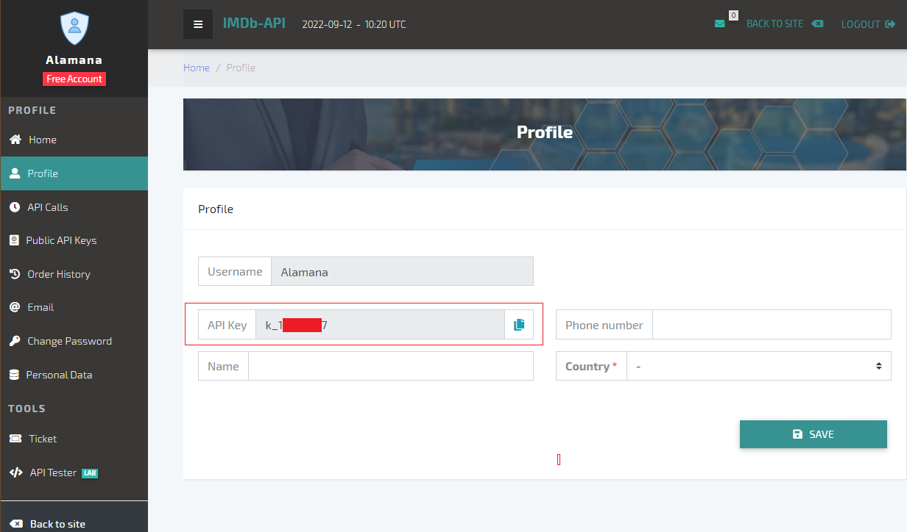

# IMDB films to email
## Введение
Целью данного проекта было поработать с различными библиотеками python, http запросами,
а также научиться деплоить это всё на сервере. Изначально задачей которую я перед собой
ставил было сделать программу/скрипт который присылал бы мне популярные фильмы (на данный момент)
без необходимости куда-то заходить и что-то делать. Т е просто в пятницу вечером смотришь почту (или телеграм)
и вот тебе фильм. При том с хорошим рейтингом, более менее новый и по определенным критериям.

## Библиотеки
Я использовал несколько библиотек как встроенных в python так и сторонних:
1. Pillow==9.2.0 --- **Библиотека для работы с изображениями**
2. requests==2.28.1 **Библиотека для http запросов**
3. yagmail==0.15.283 --- **Библиотека для отправки email** 
4. cachetools==5.2.0 certifi==2022.6.15 charset-normalizer==2.1.1 cssselect==1.1.0 cssutils==2.6.0 
idna==3.3 lxml==4.9.1 --- **Вспомогательные библиотеки**

## Хостинг
Я выбрал облачную платформу **[PythonAnywhere](www.pythonanywhere.com)**, где можно разместить бесплатно свой проект
который будет работать автономно на сервере. При бесплатном варианте есть ряд ограничений:
* Размер проекта и мощности
* Обращаться можно только к хостам из whitelist самого pythonanywhere
* Один аккаунт - одно приложение

Аналогичный функционал, обычно, стоит не меньше 3$ - 5$ в месяц, так что учитывая маленький размер и
малую важность проекта - можно ограничиться бесплатной версией.

## Подготовка
Проект сможет повторить практически каждый человек прошедший курс по Python.
Дальше будет более подробная схема работы программы, но для понимания я сразу обозначу как это работает
в общих чертах. В Российских сервисах кинопоиск, ivi, okko и прочих нет многих фильмов по разным причинам
поэтому доставать фильмы из кинопоиска (хотя там есть cвой [API](https://kinopoisk.dev/)) смысла нет. А какая же тогда
самая большая база по кино/сериалам и индустрии в целом? Правильно - imdb 

Обращаться к imdb мы будем с помощью специального [IMDB API](https://imdb-api.com/)) доступ к которому можно получить с
помощью ключа который выдается после регистрации. Есть платные версии API, где количество запросов может достигать тысячи
и десятки тысяч в сутки, но нам хватит и *trial - 100 запросов в сутки.* Пример моего API Key на картинке ниже.

Помимо ключа для обращения к imdb нам понадобится почтовый ящик с которого будет производиться отправка писем с фильмами.
Я выбрал gmail для этих целей. К сожалению, с недавнего времени, просто пароля от ящика недостаточно и необходимо для сторонних
приложений/программ получать пароль приложения. Это особый ключ который позволит нам пользовать email ящиком извне, в данном
случае из нашей программы. Получение ключа это было самым муторным для меня. Итак, алгоритм по созданию ящика и пароля приложения:
1. Создаем любую почту на gmail 
2. Получаем пароль приложения
   1. [Внимательно читаем и выполняем инстуркцию!](https://support.google.com/accounts/answer/185833)
   2. После создания пароля приложения его необходимо сохранить (он нам в дальнейшем понадобится)
   3. Выглядеть это должно +- вот так:
3. Сохраняем для себя все данные, а именно связку почта:пароль + ключ приложения для дальнейшего использования.

Теперь мы готовы к написанию кода.

## Блок схемы
Есть две схемы, одну я сделал для себя, а другую "как учили". Основная сложность, как мне видится, состоит в стеке вызовов.
1. 
В этой блок-схеме я для себя расписал как что происходит чтобы не запутаться в вызовах.
2. 

## Проблемы
Как оказалось, в pythonanywhere нельзя обращаться к ресурсам которых нет в whitelist. Imdb там оказался, но вот сервер 
с постерами нет. И это стало большой проблемой потому что изначально я хотел отправлять в email еще и постер. Для пережатия
постера как раз и использовалась библиотека Pillow и был написан класс Resizeimg, который пережимал изначальный постер 
с размером 5 мб, до приемлемых 500 кб. Помимо пережатия этот класс сохраняет соотношение сторон и сохраняет новый постер
также удаляя исходный. В общем, чтобы не платить за хостинг, я просто убрал использование этого класса и вместо постера по 
почте будет приходить ссылка. При этом просто из idea всё запускается и работает, т е всё работоспособно, но из-за специфики
хостинга пришлось вырезать.

Также я менял структуру письма и думал какую информацию оставить, а какую нет. К, сожалению, в изначальном списке 
популярных фильмов нет всей информации о фильме какая есть если запрашивать конкретный фильм и из-за этого пришлось
делать функцию film() уже из которой и можно доставать нужные нам параметры. Итоговая структура email письма такова

## Деплой 
1. Регистрируем аккаунт **[PythonAnywhere](www.pythonanywhere.com)**
   1. Запускаем bash console
   
   2. Именно с помощью этой консоли будет необходимо создать venv и установить requirements.txt
2. Выполняем создание виртуального пространства по [Инструкции](https://help.pythonanywhere.com/pages/Virtualenvs/)
3. Загружаем файлы с кодом в папку

4. Дальше действия выполняются в ранее созданной bash console. 
5. Переходим в нашу директорию cd /home/**Newone47**/.virtualenvs/**myvirtualenv** 
Жирным выделено Название вашего аккаунта и название виртуального окружения
6. [Полная справка](https://help.pythonanywhere.com/pages/RebuildingVirtualenvs/) Или просто прописываем **pip install -r requirements.txt**
чтобы установить все необходимы для работы нашего скрипта библиотеки.
7. Прописываем в консоли **python3 main_without_img.py** для запуска нашего скрипта
8. Поздравляю, вы запустили скрипт на удаленном сервере!

Для корректной работы необходимо вот еще что сделать:
* Переходим в верхнем меню в пункт **Wev**
* Прописываем пути до директории и файла как на скрине

* Раз в 3 месяца нажимаем золотую кнопку **Run until 3 months today** чтобы скрипт продолжал работать.

## Код и параметры
Чтобы просто пользоваться готовым функционалом необходимо:
1. Вставить свой ключ в imdb_api_key.py, а точнее задать его в переменной api_key. Это нужно чтобы обращаться к imdb.
2. Дальше в файле email.py необходимо прописать данные почты и код пароль приложения полученный ранее. 
3. В функции фильтре можно менять параметры. Я нашел оптимальным фильтровать только год/рейтинг/кол-во оценок, но если
вы захотите что-то добавить или убавить - это лего сделать просто добавив еще одно условие **elif i['Любой ключ словаря']**
По сути эта функция берет изначальный словарь с популярными фильмами и отфильтровывает его чтобы потом рандомно доставать 
по 1 фильму.

4. В изначальном json от imdb нет трейлера фильма и это печально. Поэтому в функции film я добавил запрос трейлера и 
добавление его в общий словарь. По сути получается 1 лишний запрос и если стоит задача оптимизировать кол-во запросов к
imdb которых всего 100 то можно просто убрать запрос трейлера. А так за 1 цикл работы программы происходит 3 запроса
к базе:
   1. Получаем список всех популярных фильмов
   2. Получаем информацию об 1 каком-то конкретном из этого списка
   3. Получаем ссылку на его трейлер
>Добавим ссылку на видео-трейлер в словарь
> 
url_video = f'https://imdb-api.com/en/API/YouTubeTrailer/{imdb_api_key.api_key}/{id_of_film}'

film_dict = json_object

film_dict['videoUrl'] = json_object_with_video['videoUrl']
#Что можно улучшить
Помимо отправки по почте можно прикрутить телеграм бота в котором фильм будет доставаться, например,
по запросу. Или подборки. Также это можно перевести на ООП рельсы, добавить интерфейс и возможность менять
фильтры для каждого пользователя.

#Чему я научился
В ходе работы над проектом я научился:
1. Делать http запросы, узнал о прокси, о портах и об серверах
2. Работать с библиотекой Pillow с помощью которой можно редактировать изображения, пережимать их, сохранять и т.п.
3. Работать с json и словарями. Обращаться к ним, переводить одно в другое и вытаскивать то что мне нужно
4. Отправлять при помощи Python email и собирать его с помощью html тегов
5. Взаимодействовать с API какого-то сервиса, получать и передавать запросы, изучил документацию API
6. Подтянул английский, потому что как водится, вся информация была на нем
7. Ориентироваться в стеке вызовов который может быть весь запутанным
8. Дебажить код на более высоком уровне 
